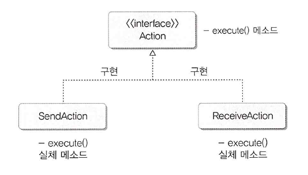

#Class 클래스 (java.lang.Class)
자바는 클래스와 인터페이스의 메타 데이터를 java.lang 패키지에 소속된 Class 클래스로 관리한다

여기서의 메타 데이터란 클래스의 이름, 생성자 정보, 필드 정보, 메소드 정보를 말한다

MetaData: 대량의 정보 가운데서 찾고 있는 정보를 효율적으로 찾아내서 이용하기 위해 일정한 규칙에 따라
콘테츠에 대하여 부여되는 데이터(도서관의 책 일련번호들)

##1. Class 객체 얻기 getClass(), forName()
프로그램에서 사용되는 Class 객체의 정보를 얻기 위해서는 object 클래스가 가지고 있는 getClass() 메소드를 이용하면 된다
Object는 모든 클래스의 최상위 클래스 이기 때문에 모든 클래스에서 getClass()를 호출할 수 있다

```java
    Class clazz = obj.getclass();
```

getClass() 메소드는 해당 클래스로 객체를 생성했을 때만 사용할 수 있으며, 
객체를 생성하기 전에 직접 Class 객체를 얻을 수 있다

하지만 Class는 생성자를 감추고 있기 때문에 new 연산자로 객체를 만들 수 없고, 정적 메소드인 forName()을 이용해서 만들어야 한다

**객체를 만드는 것과 생성하는것은 다르다 객체를 만드는것은 우리가 Class를 받아온다는 뜻이고, 생성하는것은 생성자를 통해
생성하는 것이다. Class.forName() 메소드는 객체를 생성하는 것이 아닌 만드는 것이고, 클래스 즉 설계도면을 받아온다고 
이해하면 된다**

```java
    //Class.forName()은 매개값으로 주어진 클래스를 찾지 못하면
    //ClassNotFoundException 예외를 발생시키기 때문에 try-catch를 사용해준다
    try {
        Class clazz = Class.forName(String className);
    } catch (ClassNotFoundException e) {
    
    }
```

##2. 리플렉션 getDeclaredConstructors() getDeclaredFields, getDeclaredMethod()
Class 객체를 이용하여 생성자, 필드, 메소드의 정보를 알아낼수 있다 이것을 리플렉션이라고 한다

```java
    Constructor[] constructors = clazz.getDeclaredConstructors(); //생성자 읽어오기
    Field[] fields = clazz.getDeclaredFields(); //필드 읽어오기
    Method[] methods = class.getDeclaredMethods(); //메소드 읽어오기
```

##3. 동적 객체 생성 newInstance()
Class 객체를 이용하면 new 연산자를 사용하지 않아도 동적으로 객체를 생성할 수 있다

클래스의 이름을 코드작성시에 결정할 수 없고, 런타임 시에 클래스 이름이 결정되는 경우 사용된다

Class.forName() 메소드로 Class 객체를 얻은 다음 NewInstance로 객체를 생성한다

```java
    try{
    Class clazz=Class.forName("얻어올 클래스 객체");
    //Object형으로 리턴하기 때문에 강제 타입 변환을 해줘야한다 
    // 다만 클래스 타입을 모르기 때문에 인터페이스에게 상속을 받는 클래스를 이용한다
    // (Interface Type) clazz.newInstance();
    Object obj=clazz.newInstance();
    //forName에서 던지는 예외처리
    } catch (ClassNotFoundException e) {      
    //newInstance()를 할때 반드시 해줘야하는 예외처리
    } catch (InstantiationException e) {
    } catch (IllegalAccessException e) {
    }
```
### 3.1 강제 타입 변형을 위한 인터페이스 사용
newInstance로 부터 생성되어 리턴된 객체는 타입이 Object 이기 때문에 강제 타입 변형이 필요한데

리턴된 객체의 클래스 타입을 모르기 때문에 interface를 사용하여 이를 해결한다



위와 같이 Action 인터페이스와 구현클래스인 SendAction, ReceiveAction 이 있다고 가정하고

Class.forName()의 매개값으로 구현클래스를 넘겨주면, newInstance()의 리턴값을 구현클래스의 인터페이스 타입으로
강제 타입 변환이 가능해진다 인터페이스 타입으로 타입 변환이 되었기 때문에 구현클래스의 오버라이딩 된 메소드를 사용할 수 있다

### 3.2 newInstance 사용시 필요한 예외처리
Class.newInstance() 메소드를 사용할때 반드시 해줘야하는 예외처리가 두가지 있다. 

InstantiationException: 해당 클래스가 추상클래스 이거나 인터페이스 일 경우 발생

IllegalAccessException: 클래스나 생성자가 접근제한자로 인해 접근할 수 없을 경우에 발생
