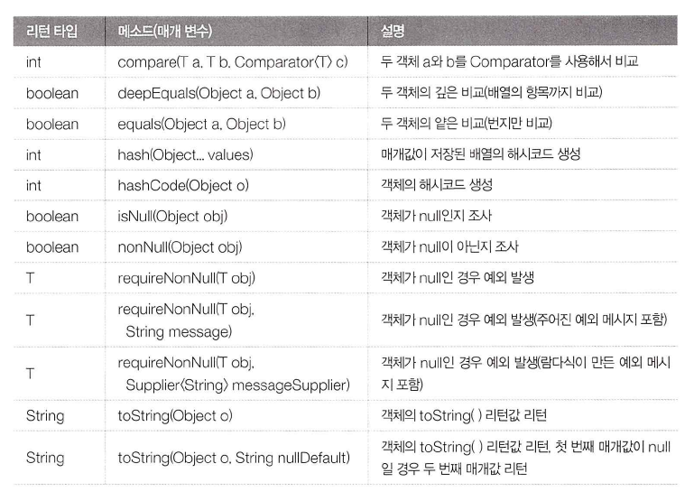

# Objects Class (java.util.Objects)
java.util 패키지에 속하여 있으며 **객체 비교, 해시코드 생성, null 여부, 객체 문자열 리턴**등의 연산을
수행하는 정적 메소드들로 구성된 Object 의 유틸리티 클래스이다




## 1. 객체 비교 (Compare(T a, T b, Comparator\<T>c))
Objects.compare(T a, T b, Comparator<T>c) 메소드는 두객체를 비교자 (Comparator) 로 비교해서 int값을
리턴한다

java.util.Comparator<T>는 제네릭 인터페이스 타입으로 두객체를 비교하는 compare(T a, T b) 메소드가 
정의되어 있다

a가 b보다 작으면 음수, 같으면 0, 크면 양수를 리턴하도록 구현 클래스를 만들어야 한다

## 2. 동등 비교(equals()와 deepEquals())
Objects의 equals는 두 객체의 동등을 비교하는데 

a와 b가 모두 null일 경우 true를 리턴하고,

모두 null이 아닐 경우에는 a.equals(b)의 결과를 리턴한다

둘중 하나만 null일 경우에는 false 를 리턴한다

deepequals 역시 두 객체의 동등을 비교하는데,  a와 b가 서로 다른 배열일 경우, 항목 값이 모두 같다면 true를
리턴한다 즉, deepequals는 배열 내부까지 검사한다는 점에서 equals와 차이가 있다

``` 
    Integer[] arr1 = {1,2}
    Integer[] arr2 = {1,2}
    
    System.out.println(ObjectsdeepEquals(arr1, arr2)); //true
```

Arrays.deepEquals(Object[]a, Object[] b) 와 동일하다

## 3. 해시코드 생성(hash(), hashCode())
Objects.hash(Object ... values) 메소드는 매개값으로 주어진 값들을 이용해서 배열을 생성하고
Arrays.hashCode(Object[])를 호출해서 해시코드를 얻은뒤 이 값을 리턴한다

```
    @Override
    public int hashCode() {
        return Objects.hash(field1, field2, field3);
    }
```

Objects.hashCode(Object o) 는 매개값이 null 일 경우 0을 리턴한다

## 4. 널 여부 조사 (isNull(), nonNull(), requireNonNull())
isNull - 매개값이 null일 경우 true를 리턴한다

nonNull - 매개값이 not null일 경우 true를 리턴한다

requireNonNull() - 매개값이 not null  이면 첫 번째 매개값을 리턴, 
null이면 모두 NullPointerException을 발생

매개변수에 따라 3가지의 오버로드를 가지고 있다


## 5. 객체 문자 정보(toString())
객체의 문자 정보를 리턴하는데 두가지의 오버로딩을 가지고 있다


첫번째 매개값이 not null 이면 toString()으로 얻은 값을 리턴하고, 

null 이면 "null" 또는 두 번째 매개값인 nullDefault를 리턴한다