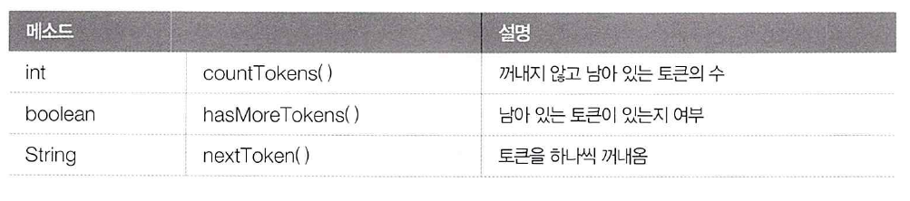

# StringTokenizer Class (java.util)
문자열이 특정 구분자 (delimiter)로 연결되어 있을경우, 구분자를 기준으로 부분 문자열을 분리하기 위해서는
String의 split() 메소드를 이용하거나 java.util 패키지의 StringTokenizer 클래스를 이용해야한다

split()의 경우 정규 표현식(&,-, /  등..)을 구분자로 할때 사용한다
```java
    String[] result = "문자열".split("정규표현식");
    //여러개의 정규 표현식을 사용하고 싶을경우
    String[] result = "문자열".split("& | ?"); // | (OR)을 통해 여러개를 사용할 수 있다
```

##StringTokenizer 사용
**문자열이 한종류의 구분자로 연결되어 있을 경우**, StringTokenizer 클래스를 사용하면 손쉽게 문자열(토큰: token)을
분리해 낼 수 있다

StringTokenizer 객체를 생성할 떄 첫 번째 매개값으로 전체 문자열을 주고, 두번째 매개값으로 구분자를 주면된다
```java
    //StringTokenizer st = new StringTokenizer("문자열", "구분자")
    String text = "홍길동/이수홍/박연수";
    StringTokenizer st = new StringTokenizer(text, "/");
```

StringTokenizer의 메소드


```java
    st = new StringTokenizer(text, "/");
    int count = countTokens(); //꺼내지 않고 남아있는 토큰의 갯수
    while(st.hasMoreTokens()) { //토큰이 남아있는지 확인
        String token = st.nextToken(); //다음 토큰을 꺼내옴
        System.out.println(token);
    }
```
